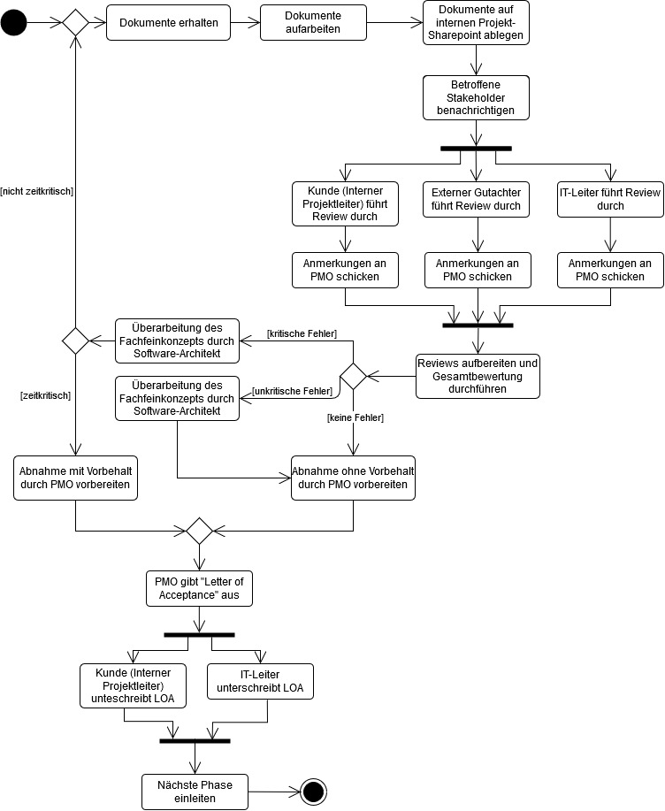

# SE-Übung 2
von Laurenz Dilba (9037743) und Ron Autenrieb (9037538)

## Aufgabe 1

## Test Suite

### Tests
TestCase No. | Category | Äquivalenzklasse | Input | Output
--- | --- | --- | --- | --- |
1 | pos | Ä7 | | 0
2 | pos | Ä1 | Member ID:1 | 
3 | pos | Ä1 | Member ID:2 | 
4 | pos | Ä1 | Member ID:3 | 
5 | neg | Ä1 | Member ID:4 | Das Member-Objekt mit der ID \[3\] ist bereits vorhanden!
6 | pos | Ä7 | | 3
7 | pos | Ä3 | 1 | Member (ID = \[1\]) deleted
8 | neg | Ä4 | 1 | Member (ID = \[1\]) not found
9 | pos | Ä3 | 2 | Member (ID = \[2\]) deleted
10 | pos | Ä3 | 3 | Member (ID = \[3\]) deleted
11 | pos | Ä5 | | "Member (ID = \[1\])"
12 | pos | Ä5 | | "Member (ID = \[1\])\nMember (ID = \[2\])"
13 | pos | Ä5 | | "Member (ID = \[2\])"

### Zugehörige Äquivalenzklassen
Parameter | Äquivalenzklasse | Repräsentant
--- | --- | ---
addMember | pos_Ä1 (ID not in Container) | Member ID:1
addMember | neg_Ä2(ID in Container) | Member ID:70
deleteMember | pos_Ä3 (ID in Container) | Member ID:70
deleteMember | neg_Ä4(ID not in Container) | Member ID:1
dump | pos_Ä5(All Members in outputed) | "Member (ID = \[1\])"
dump | neg_Ä6(Not all Members outputed) | ""
size | pos_Ä7(Number of  Elements same as Number of Members ) | 
size | neg_Ä8(Number of  Elements not same as Number of Members) | 